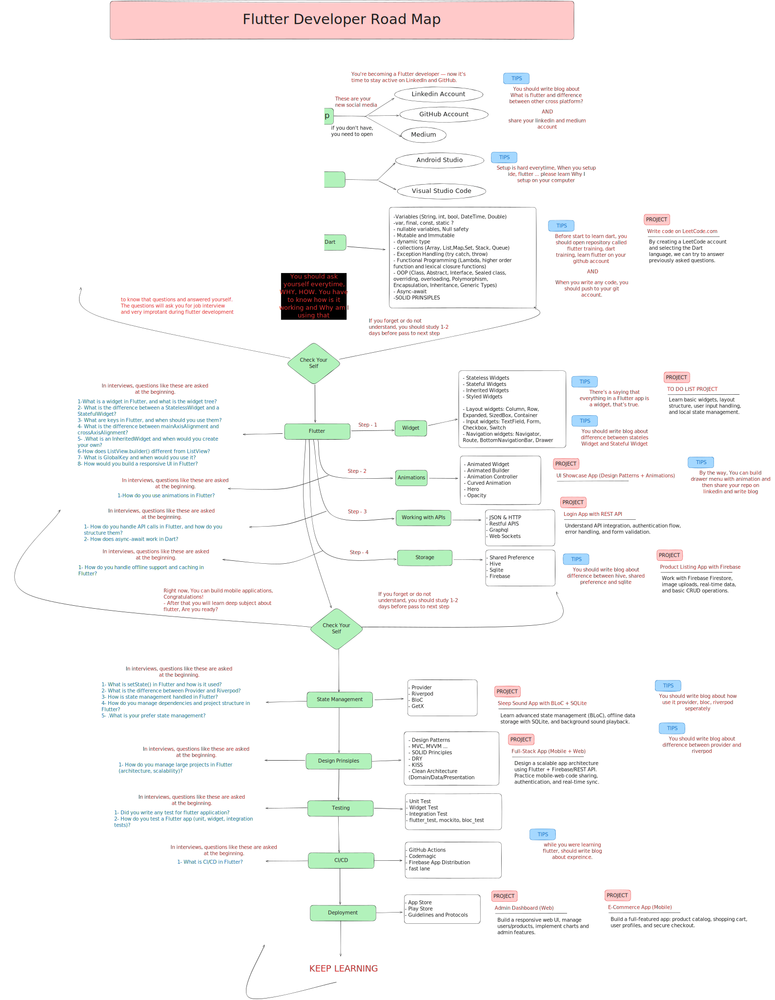

# 🚀 Flutter Roadmap (Beginner's Guide)

## 🌟 Why I Created This Roadmap

For a long time, I’ve been taking notes and asking myself:

- “How can I learn Flutter more effectively?”
- “Where should I start?”
- “What’s the ideal order to follow?”

After months of planning and reflection, I’ve finally created a **comprehensive Flutter roadmap** for anyone who wants to build mobile apps — especially students and aspiring Flutter developers.

---

## 📌 Roadmap Overview

---

## 🧩 What This Roadmap Covers

### ✅ Structured Learning Path

- **Left Column**: Real interview questions I personally encountered during my job search.
- **Center**: The core learning journey, from basics to advanced topics.
- **Right Side**:
    - What you will learn in each phase
    - Key tips & reminders
    - Blog topics to write
    - Research tasks & mini project ideas

---

### 🎯 Real Questions, Real Experience

All interview questions are based on real-life interviews — this helps you understand what matters in the industry.

---

### 🤝 Learn & Share

This roadmap isn’t just about learning code. It’s about becoming a professional developer by **sharing knowledge**.

💡 Recommended actions:

- ✍️ Write blog posts (e.g. Medium)
- 🧑‍💻 Be active on GitHub
- 💬 Share insights on LinkedIn

Sharing helps you reinforce your learning and build your personal brand.

---

### 📚 Step-by-Step Progress

- Start with **Dart fundamentals** and master the language.
- Move on to **Flutter basics**, then progress into more complex topics.
- Includes **pause & repeat** sections for better retention.
- Ends with **advanced concepts** and **best practices** for real-world apps.

---

### 🔍 Deep Dive into Details

On the right side of the roadmap, you’ll find helpful cues and technical prompts for Flutter devs — great for reviewing your knowledge, spotting weak areas, and reinforcing forgotten concepts.

---

## 💬 Final Words

Thanks for checking out this roadmap!

Feel free to reach out to me anytime at **suleymansurucu95@gmail.com** — I’d be happy to support your learning journey.

You can complete this roadmap solidly within **6–7 months**, even by studying just once every 2 weeks or monthly.

> **Remember:** The most important step is to start. The second is to know what to do next. 🧭
